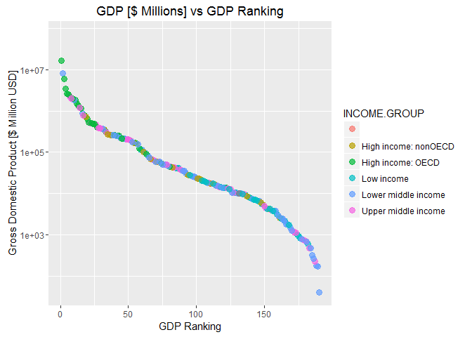

# CaseStudy1
Brian Yu  
October 30, 2016  
# Introduction
From the World Bank's data catalog, I provided a methodology and documentation for loading, tidying, merging, and analyzing the Gross Domestic Product data for the 190 ranked countries and the Educational data from the data catalog. The necessary files that are called from this RMD are the following:

* Gather1.R, download and clean the GDP data
* Gather2.R, download and clean the Educational data
* MergeData.R, merge the cleaned GDP and Educational data

The deliverable from this project was to code, and provide a framework to answer the five questions presented to us from the client. The five questions are clearly answered in this R Markdown document along with the necessary code.


# Gathering and Cleaning Data
* Gather and cleanup raw data files
* Each .R file below gathers data from a different source and cleans the data

```r
library(knitr)
source("./Analysis/Data/Gather1.R")
source("./Analysis/Data/Gather2.R")
```

# Merging Data
* Merge GDP data and Educational data from Gather1.R and Gather2.R

```r
## Merge Data
source("./Analysis/Data/MergeData.R")
```

# Five Questions on Merged Data:
### Question 1

```r
sum(!is.na(unique(MergedData$RANKING)))
```

```
## [1] 189
```
There are 189 unique IDs that matched by merging the data sets based on the country shortcode

### Question 2

```r
MergedData[order(RANKING, decreasing=TRUE), list(COUNTRYCODE, LONG.NAME.x, RANKING)][13]
```

```
##    COUNTRYCODE         LONG.NAME.x RANKING
## 1:         KNA St. Kitts and Nevis     178
```
From sorting the data frame in ascending order by GDP, the 13th country in the resulting
data frame is St. Kitts and Nevis.

### Question 3

```r
MergedData[, mean(RANKING, na.rm = TRUE), by = INCOME.GROUP]
```

```
##            INCOME.GROUP        V1
## 1: High income: nonOECD  91.91304
## 2:           Low income 133.72973
## 3:  Lower middle income 107.70370
## 4:  Upper middle income  92.13333
## 5:    High income: OECD  32.96667
## 6:                   NA 131.00000
## 7:                            NaN
```
From the result, the average rankings for "High income: OECD" is 32.9667 and
for "High income: nonOECD" is 91.91304.

### Question 4

```r
library(ggplot2)
ggplot(MergedData, aes(x=RANKING,y=GDP.VALUE))  + 
  scale_y_log10() + geom_point(aes(colour=INCOME.GROUP), alpha = 0.7, size=3) +
  ggtitle( "GDP [$ Millions] vs GDP Ranking") +
  labs(x = "GDP Ranking", y = "Gross Domestic Product [$ Million USD]")
```

```
## Warning: Removed 48 rows containing missing values (geom_point).
```

<!-- -->

### Question 5

```r
## Creating a break vector cut ranking into 5 separate quantile groups
breaks <- quantile(MergedData$RANKING, probs = seq(0, 1, 0.2), na.rm = TRUE)
MergedData$QTLS <- cut(MergedData$RANKING, breaks = breaks)
## Previwing table with new QTLS
table(MergedData$QTLS)
```

```
## 
##    (1,38.8] (38.8,76.6]  (76.6,114]   (114,152]   (152,190] 
##          37          38          38          38          38
```

```r
## Final table comparing Quantiles and Income Groups
table(MergedData$INCOME.GROUP, MergedData$QTLS)
```

```
##                       
##                        (1,38.8] (38.8,76.6] (76.6,114] (114,152] (152,190]
##                               0           0          0         0         0
##   High income: nonOECD        4           5          8         4         2
##   High income: OECD          17          10          1         1         0
##   Low income                  0           1          9        16        11
##   Lower middle income         5          13         12         8        16
##   Upper middle income        11           9          8         8         9
```
There are 5 countries that are categorized in the 'Lower middle income' group but among
the 38 nations with the highest GDP.

# Conclusion
Utility of R and R Markdown provided a method to source, clean, and analyze the data in a single environment that is reproducible for any researcher. From the output of question 3, as expected, the "High income: OECD" yielded the lowest average GDP ranking, which is the highest average Gross Domestic Product [$ millions]. From further observation of the data, one country which was categorized as "High income:OECD" but was in the 4th quartile (114,152), which was conspicuous.

